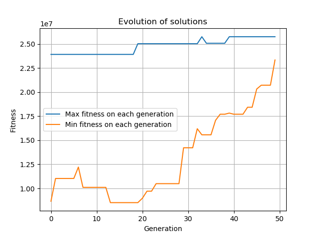

# Edgar-Duarte
# Computación evolutiva

## Problema a resolver

El problema consiste en la localización de una cantidad de instalaciones (xj) en un conjunto de nodos de demanda (zi) de tal manera que se maximice la cobertura de demandas de cada nodo. El problema se encuentra detallado en la literatura sobre localización de instalaciones como el **Max Covering Problem** (Daskin, M. S. (Ed.). (2013). Network and Discrete Location: Models, Algorithms, and Applications, Second Edition. https://doi.org/10.1002/9781118537015).

### Algoritmo genético

Esta implementación del algoritmo genético tiene las siguientes características:
- Representación:
Cada posible solución consiste en un cromosoma de longitud zi + xj. La extensión zi corresponde a los posibles nodos de demanda y para ello se utilizó una cadena binaria. La extensión xj corresponde a las posibles localizaciones de las instalaciones que surtirán a los nodos de demanda. 
Así, un cromosoma puede tener la siguiente estructura:
zi=100100101110 --> Corresponde a doce posibles nodos de demanda.
xj=10001 --> Corresponde a cinco posibles localizaciones.

- Función de utilidad y restricciones:
(Pendiente por redactar en notación matemática)
Maximizar suma(hi zi)
Sujeto a:
zi <= suma(aij xj) para cada i
suma (xj) <= P
xj = 1,0
zi = 1,0
- Operadores
El operador de selección actúa sobre una población inicial a través de la estrategia de torneo.
El cruce se diseño aplicando operadores independientes para los componentes de demanda y de oferta de los cromosomas (zi y xj). Así, una vez se decide realizar el cruce, el algoritmo implementa el cruce tanto para el componente de demanda como para el de oferta. 
El operador de mutación funciona de manera similar al de cruce. Se selecciona un cromosoma y se aplica el operador de manera independiente al componente de demanda y al de oferta. 
Para la operación de reemplazo se actúa sobre dos poblaciones origen: padres que provienen de la selección e hijos que provienen del cruce y la mutación consecutivamente. El algoritmo selecciona un porcentaje de los mejores padres y un porcentaje de los hijos (aleatorio) y agrega estos individuos a la nueva población. Una cantidad restante es seleccionada aleatoriamente de la población inicial. 

### Instancia
El algoritmo se ejecuta sobre una `instancia de 88 ciudades` link:  utilizada por Daskin en su libro sobre localización de instalaciones (Daskin, M. S. (Ed.). (2013). Network and Discrete Location: Models, Algorithms, and Applications, Second Edition. https://doi.org/10.1002/9781118537015). 

## Primeros resultados
Una primera ejecución para validación del modelo se realizó con los siguientes parámetros:
size_pop=20 #Size of the population
lengthzi=20 #lengthzi of each chromosome
lengthxj=5 #Number of possible locations
prob_cross=0.7 #Crossing probability
prob_mutate=0.2 #Mutation probability
porc_parents=0.1 #Parents percentage for replacing
porc_children=0.4 #Children percentage for replacing
tmax=50 #Number of generations
runs=1 #Number of runs

En el resultado se advierte una posible convergencia pero todavía falta evaluar la calidad de la implementación (exploración):


## Implementación

`Algoritmo genético en Python para MAXCP` link: 
  ```bash
  pip3 install black  # only required the first time
  black .
  ```
